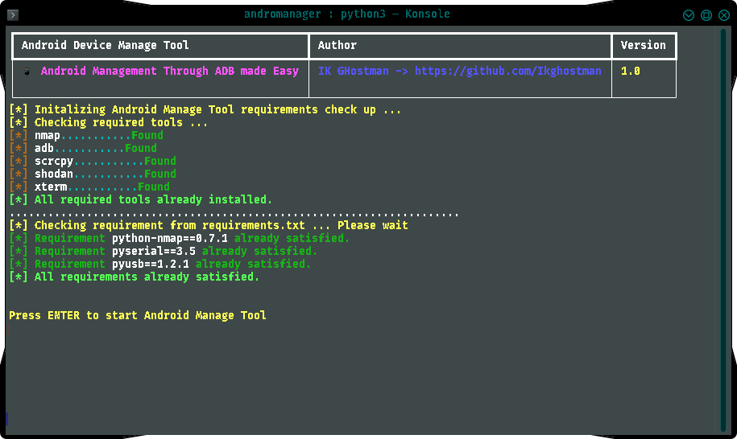
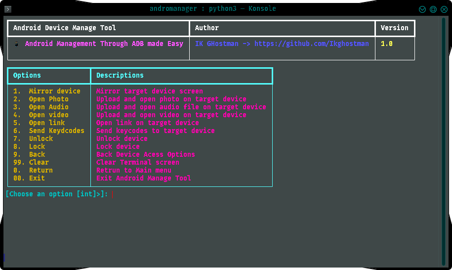
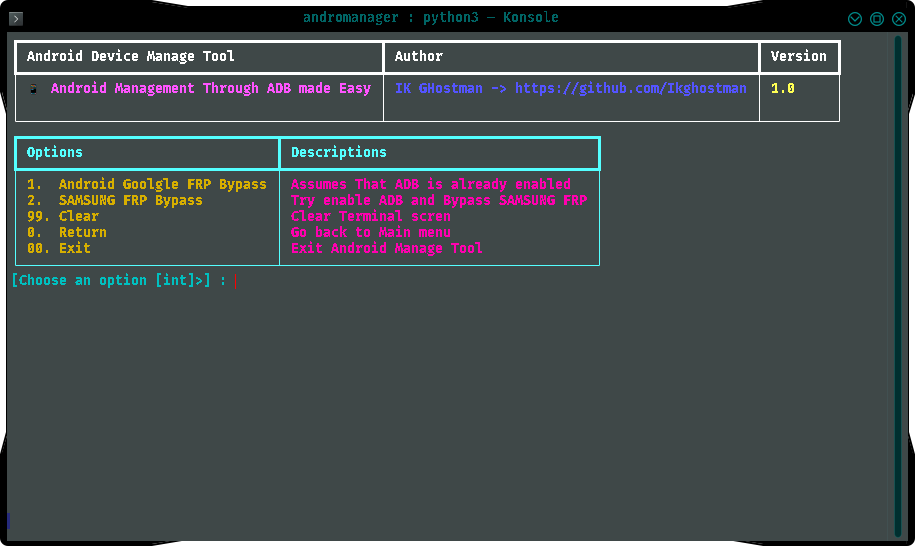

<div align="center">
  
# Android Manage Tool
  
### Android Management through ADB made easy.

The next generation ADB Toolkit written in `Python` for exploiting Android devices using `ADB` (Android Debug Bridge).


</div>

#### Easy interface whith various options to perform ADB operations on Android Devices

This tool can be used to automate Android devices files and  applications management and to remotely access Android Device if the device has open ADB port `TCP 5555`.

# Goals 

* Penetration testing and vulnerability assessment on Android devices easy.
* Automatatisation of commands and arguments for testing security of your Android devices easily.

# Special Thanks

* All thansk to `Mohd Azeem` for the full futured tool __PhoneSploit-Pro__ disponible at: [here](https://github.com/azeemidrissi/PhoneSploit-Pro)

* Thank to this blog [here](https://blog-cyber.riskeco.com/en/analysis-of-samsung-frp-bypass/) 

* And thanks to the galaxy-at-tool repo [here](https://github.com/apeppels/galaxy-at-tool/)

# Screenshots








# Features 

## v1.0

* All in one place options to manage ADB server.
* Devices options: A feature to select, connect, disocnnect, list devices and scan network for connected devices.
* Gather device information.
* Andoir Goolge FRP Bypass/Samsung Google FRP Bypass: A feature that tries to remove frp lock on android and samsung devices
* __All in one advanced device access options__:
  - Device Camera Access: Take Screenshots, Record device screen.
  - Device Microphone access: Record and Stream audio using target device microphone.
  - Device Files Managers: Download files from device, upload files or open files on target device.
  - Device Telephony datas access: Dumps contacts, Call logs or SMS of target device.
  - Device Apps Manage: List apps, Extract apps from device, install, uninstall or launch apps on device.
  - Device Reboot options: Restart or reboot target device into specific mode `Fastboot`, `Recovery`, `Bootloader`.

# Requirements  

* [`python3`](https://www.python.org/) : Python 3.10 or Newer
* [`pip3`](https://pip.pypa.io/en/stable/installation/) : Package installer for Python
* [`adb`](https://developer.android.com/studio/command-line/adb) : Android Debug Bridge (ADB) from `Android SDK Platform Tools`
* [`scrcpy`](https://github.com/Genymobile/scrcpy) : Scrcpy
* [`nmap`](https://nmap.org/) : Nmap
* [`shodan`](https://shodan.io/): Shodan 

# Run Android Manage Tool 

Run `python3 setup_check.py` to make sure that all requirements and required tools are installed on your system.

If `the rich module` is not installed by default , install it before running tool

If all are are set up , __Android Manage Tool__ runs using `python3 main.py` or `python3 setup_check.py`.


> [!IMPORTANT]
> **Android Manage Tool** requires Python version __3.10 or higher__. Please update Python before running the program.

#### On Linux / macOS :

Make sure all the [required](https://github.com/ikghostman/androidmanager#requirements) software are installed.

Open terminal and paste the following commands : 
```
git clone https://github.com/ikghostman/androdmanager
```
```
cd androidmanager/
```
```
pip3 install -r requirements.txt
```
```
python3 seup_check.py or python3 main.py
```

# Tutorial


## Setting up Android Phone for the first time

* __Enabling the Developer Options__

1. Open `Settings`.
2. Go to `About Phone`.
3. Find `Build Number`.
4. Tap on `Build Number` 7 times.
5. Enter your pattern, PIN or password to enable the `Developer options` menu.
6. The `Developer options` menu will now appear in your Settings menu.

* __Enabling USB Debugging__

1. Open `Settings`.
2. Go to `System` > `Developer options`.
3. Scroll down and Enable `USB debugging`.

* __Connecting with Computer__

1. Connect your Android device and `adb` host computer to a common Wi-Fi network.
2. Connect the device to the host computer with a USB cable.
3. Run __Android Manage Tool__, select `ADB daemon utilities` and `start server`
4. A pop-up will appear in the Android phone when you connect your phone to a new PC for the first time : `Allow USB debugging?`.
5. Click on `Always allow from this computer` check-box and then click `Allow`.
6. From `Devices options` select `enable TCP`
7. Now you can connect the Android Phone with the computer over Wi-Fi using `adb`.
8. Disconnect the USB cable.
9. Go to `Settings` >  `About Phone` > `Status` > `IP address` and note the phone's `IP Address`.
10. Run __Android Manage Tool__ and from `Devices options` select `connect`  and enter the target's `IP Address` to connect over Wi-Fi.


## Connecting the Android phone for the next time

1. Connect your Android device and host computer to a common Wi-Fi network.
2. Run __Android Manage Tool__ and from `Devices options` select `connect`  and enter the target's `IP Address` to connect over Wi-Fi.


# This tool is tested on

-  ✅ Kali Linux

> [!NOTE]

> All the features of Android Manage Tool are only tested on **Kali Linux**.

>**Linux** is the required and recommended os for running Android Manage Tool.

> The Tool is not portable for Windows Systems

# Installing ADB 

#### ADB on Linux :

Open terminal and paste the following commands :

* __Debian / Ubuntu__
```
sudo apt update
```
```
sudo apt install adb
```

* __Fedora__
```
sudo dnf install adb
```

* __Arch Linux / Manjaro__
```
sudo pacman -Sy android-tools
```

For other Linux Distributions : [Visit this Link](https://developer.android.com/studio/releases/platform-tools#downloads)

#### ADB on macOS :

Open terminal and paste the following command :

```
brew install android-platform-tools
```

or Visit this link : [Click Here](https://developer.android.com/studio/releases/platform-tools.html#downloads)


# Installing scrcpy

Visit the `scrcpy` GitHub page for latest installation instructions : [Click Here](https://github.com/Genymobile/scrcpy#get-the-app)

> [!IMPORTANT]  
> If `scrcpy` is not available for your Linux distro like **Kali Linux**, then you can either manually install it : [Manual Guide](https://github.com/Genymobile/scrcpy/blob/master/doc/linux.md),
or build it with a few simple steps : [Build Guide](https://github.com/Genymobile/scrcpy/blob/master/doc/build.md#build-scrcpy)

# Installing Nmap

#### Nmap on Linux :

Open terminal and paste the following commands :

* __Debian / Ubuntu__
```
sudo apt update
```
```
sudo apt install nmap
```

* __Fedora__
```
sudo dnf install nmap
```

* __Arch Linux / Manjaro__
```
sudo pacman -Sy nmap
```

For other Linux Distributions : [Visit this Link](https://nmap.org/download.html)

#### Nmap on macOS :

Open terminal and paste the following command :

```
brew install nmap
```

or Visit this link : [Visit this Link](https://nmap.org/download.html)


# Disclaimer

* Neither the project nor its developer promote any kind of illegal activity and are not responsible for any misuse or damage caused by this project.
* This project is for educational purpose only.
* Please do not use this tool on other people's devices without their permission.
* Do not use this tool to harm others.
* Use this project responsibly on your own devices only.
* It is the end user's responsibility to obey all applicable local, state, federal, and international laws.

# Developer

**Ik Ghostman** - [@IkG-hostman](https://github.com/ikghostman/)
 

Copyright © 2025 Ismael .K Ghostman (github.com/ikghostman)
